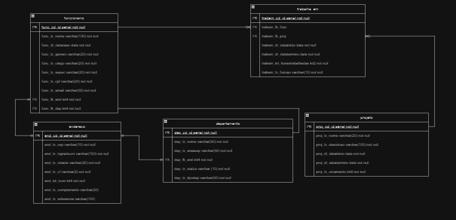

# aula-Banco-de-dados-Individual
<h1 align="center">
    
</h1>

## :detective:Índice

<ul>
    <li>Sobre o Projeto</li>
    <li>Tecnologias utilizadas</li>
    <li>Diagrama</li>
    <li>Autores do Projeto</li>
</ul>

## :desktop_computer:Sobre o Projeto

Uma empresa com vários departamentos com um ou mais funcionários e cada funcionário pode participar de 1 ou mais projetos

Regras:

- Cada funcionário deve ter apenas um departamento.
- Um departamento pode ter vários funcionários.
- A especialização de um funcionário tem que ser a mesma ou próxima da area especializada do departamento.
- Um projeto poder ter 1 ou mais funcionários.
- Um funcionário pode trabalhar em 1 ou mais projetos.

## :hammer_and_wrench: Tecnologias utilizadas

- [DBeaver](https://dbeaver.io/download/)
- [PostgreSQL](https://www.postgresql.org)
- [Draw.io](https://app.diagrams.net/)
- [GitHub](https://github.com/)

## :chart_with_upwards_trend: Diagramas

  ## Modelo Conceitual
   
  
  ## Modelo Lógico
   

## Autores
- :boy:
Victor Hugo Martins França - https://github.com/VictorHmfr
